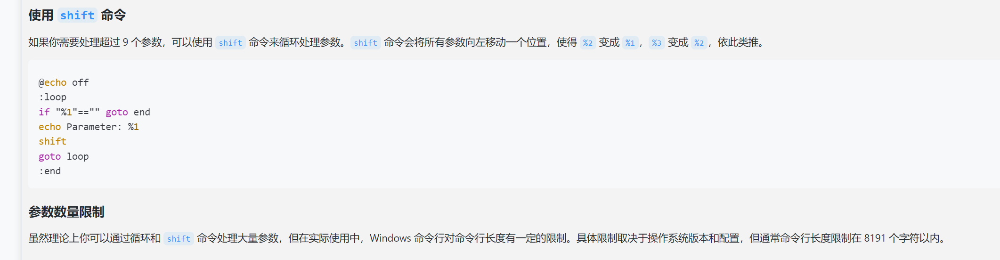
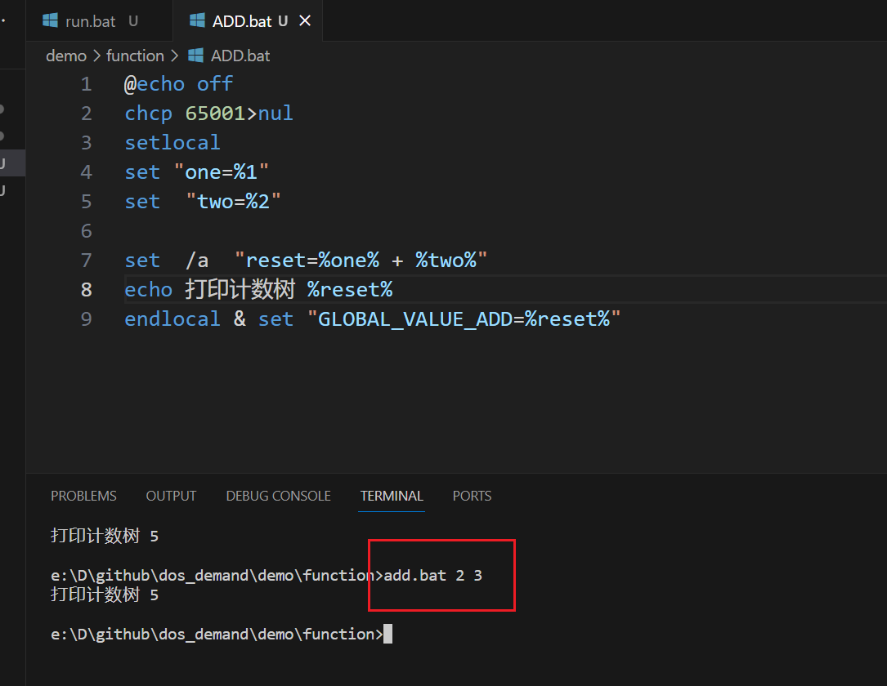

### 说明

1 利用 call  模拟 function调用

2 日常用一个一个功能 都写道 一个一个 bat中  

3 为了解决变量冲突每bat 设置 setlocal  endlocal 

4  最后利用& 链接符号把变量传递给全局变量 GLOBAL_VALUE_XXX

5 主函数 使用 call  fload\xxx.bat  传递参数 调用  

6 最后利用 GLOBAL_VALUE_XX 进行全局调用的  

#### 关于doc传递参数个数问题 【默认 9个 】

超过9个做法， 没有实践过最为一个函数最好不要超过9个，如果超过 很多数据，可以写入文件，传递一个
文件地址 

#### 具体做法说明 

##### 函数使用
* 函数自己和运行情况
* **函数参数传递%[1-9]**
* 函数都需要设置局部变量内完成
* 函数最后&链接符号设置全局变量 输出要计算的参数 
* 关于中文 chcp 65001>nul  必须

##### 调用过程 
* 关于中文用chcp 
* 关于函数调用用 call  folder/xx.bat  xx xx  
* 然后利用全局变量来接入 函数 
* 

### 关于运行测试
* 使用vscode编写
* 安装插件直接debug 运行 
  
  

### 在bat实际俺案例中多 bat 调用过程 

